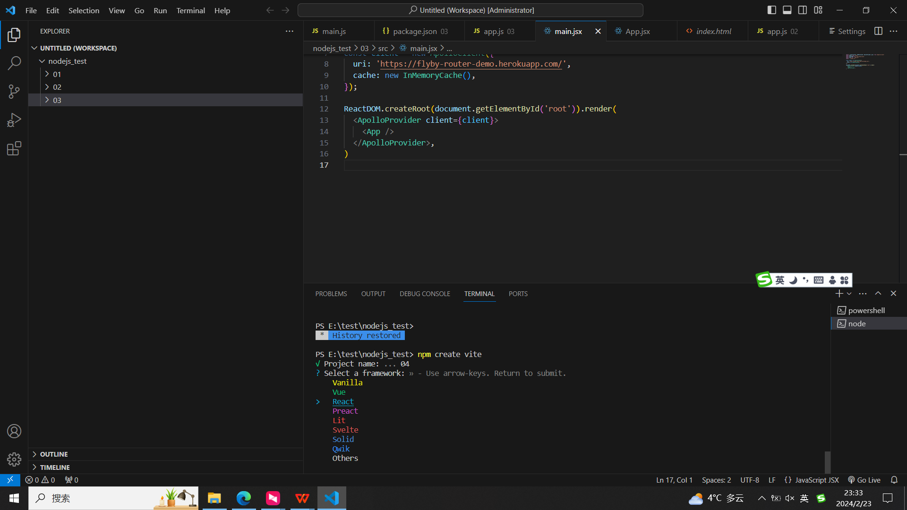

React框架下apollo client开发，读取SPIKE数据
1，用VS CODE
2，要安装node js
3，在VS CODE的控制命令行输入npm create vite，输入工程名，并选择React和Javascript，这样就可以生成React脚手架

4，根据提示，分别cd到工程中，用npm i安装相关依赖。如果要执行代码时，首先执行npm run dev
img src="imgs/react_framework2.png"/>
根据提示，点击localhost:xxx的链接就可以在浏览器中执行客户端了
img src="imgs/client.png"/>
5，可以在main.jsx、app.jsx里修改代码，也可以自己创建jsx文件。
6，本文件夹中有两个ChartComponent文件，ChartComponent_simple.jsx是用数字显示读取的spike数据，ChartComponent.jsx是结合了echarts将数据用折线图显示。
7，本代码除了开始用npm i安装的React相关依赖以外，还要安装npm i @apollo/client graphql echarts。两个json文件是写代码时安装的依赖库的版本信息。
8，如果在浏览器中输入ip地址，而不是localhost，修改package.json文件中"dev": "vite --host 0.0.0.0"。
